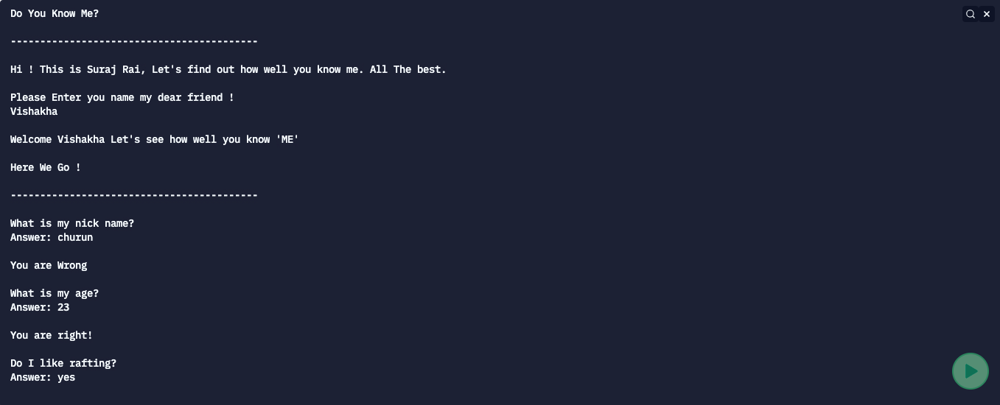

# Do You Know Me

This CLI App is written in Javascript. It consists of the questions about myself which my friends would have to answer and on the basis of points scored it will be judged how well he/she know me.

## [Click to play](https://replit.com/@SurajRai4/doYouKnowMe?embed=1&output=1#index.js)

### Below are the questions with answers for testing purposes:

        1. question: "What is my nick name?",
           answer: "Churan"
    

        2. question: "What is my age?",
           answer: "23"
    

        3. question: "Do I like rafting?",
           answer: "Yes"

        4. question: "What is my favourite street food?",
           answer: "Chilli Potato"

        5. question: "Which is my favourite chocolate?",
           answer: "Dark Chocolate"

## Screenshot 

